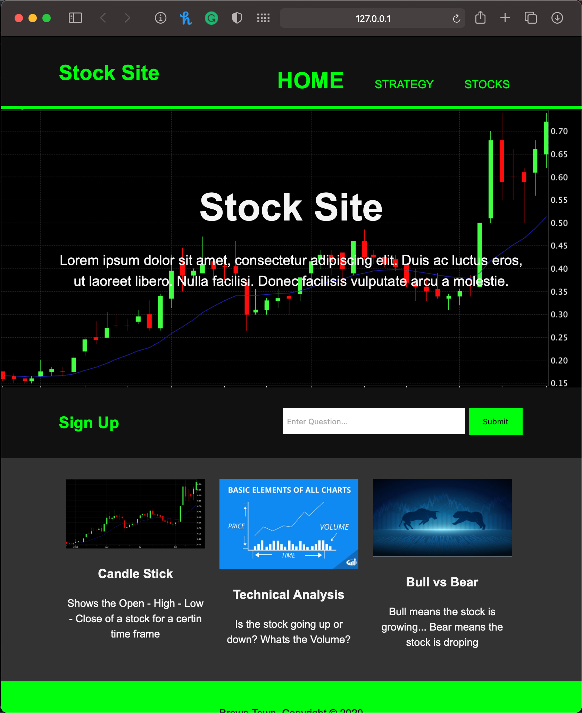
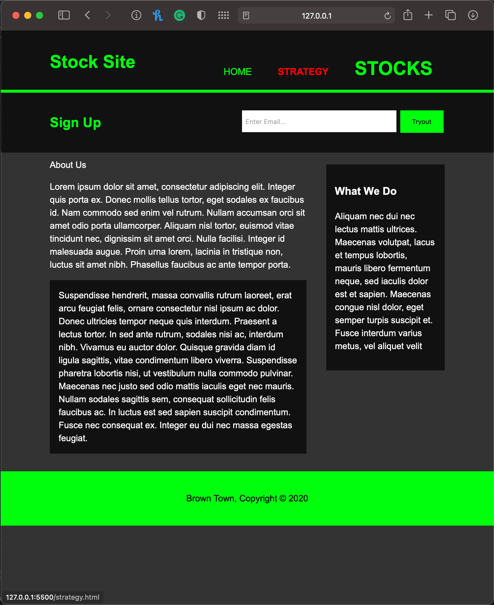
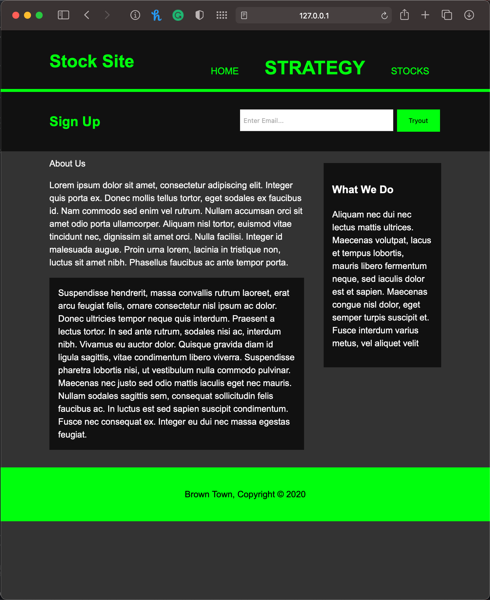

# website_examples

### This is my first go at making a website using HTML and CSS.
### Most of it is just following along with a tutorial but with my own styles added in
### 
### I also added in a project I worked on in python called shortest.py 
### This project lets you draw walls on the grid and then it will find the shortest path from the start to end

